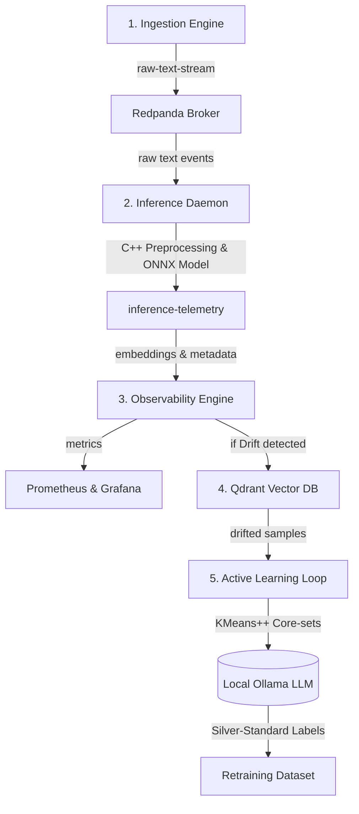

# SentinelFlow 🛡️
### Real-Time ML Observability, Drift Detection, & Active Learning Pipeline

SentinelFlow is a modular, event-driven streaming pipeline designed to monitor machine learning models in production, detect statistical feature drift, and dynamically trigger active learning feedback loops to self-heal the model.

---

## 🏗️ Architecture & Data Flow



1. **Ingestion Engine:** Simulates production traffic by streaming raw text events into Redpanda.
2. **Inference Daemon:** 
   * Preprocesses raw strings using a high-performance **C++ `pybind11` extension** (lowercase conversion, HTML/URL stripping, punctuation removal).
   * Generates text embeddings using an optimized **ONNX Runtime** model (`BAAI/bge-small-en-v1.5`).
   * Publishes complete telemetry (original text, clean text, embedding) to Redpanda.
3. **Observability Engine:** Listens to telemetry, groups embeddings in sliding windows, and checks for statistical drift against a baseline profile using **Wasserstein Distance** and **Maximum Mean Discrepancy (MMD)** via `alibi-detect`.
4. **Drift Storage (Qdrant):** If feature drift is flagged, the entire out-of-distribution window is persisted to a vector database.
5. **Active Learning (Self-Healing):** Pulls drifted embeddings, clusters them with **KMeans++** core-sets to find diverse and representative samples, and utilizes a local LLM (**Ollama LLaMA3**) to auto-categorize (label) them for downstream model retraining.

---

## 📂 Project Structure

```bash
├── active_learning/
│   └── main.py          # Active Learning loop, KMeans++ core-set selection & Ollama labeling
├── baseline_data/       # Baseline profiles (auto-generated on startup)
├── inference/
│   ├── cpp/
│   │   └── cleaner.cpp  # High-performance C++ text cleaner
│   ├── export_onnx.py   # Optimum ONNX model exporter
│   ├── main.py          # Inference consumer & telemetry producer
│   └── setup.py         # Pybind11 build configuration
├── ingestion/
│   └── main.py          # Mock traffic data generator & producer
├── observability/
│   ├── baseline.py      # Baseline profile generator
│   └── main.py          # Drift detector (MMD & Wasserstein) & Prometheus metrics exporter
├── docker-compose.yml   # Multi-container orchestration (Redpanda, Qdrant, Prometheus, Grafana)
├── prometheus.yml       # Prometheus configuration
├── Makefile             # Automation shortcuts
└── README.md
```

---

## 🚀 Quick Start Guide

### Prerequisites
* Docker & Docker Compose
* Python 3.10+
* C++ compiler (clang/gcc)
* [Ollama](https://ollama.com/) (running locally with `llama3` downloaded for the self-healing loop)

---

### Step 1: Start the Infrastructure Stack
Spin up the message broker, vector database, and observability dashboard stack:
```bash
docker-compose up -d
```

### Step 2: Set up Redpanda Topics
Run the Makefile setup command to initialize the raw text stream and telemetry message queues:
```bash
make setup-redpanda
```

### Step 3: Export the ONNX Embedding Model
Since the ONNX binary model is gitignored, download and export it to the local runtime path:
```bash
python3 inference/export_onnx.py
```

### Step 4: Build the High-Performance C++ Text Cleaner
Compile the C++ text preprocessing library as a local Python extension:
```bash
make build-cpp
```

### Step 5: Start the Streaming Services

For a full demo run, execute the following commands in separate terminal sessions:

1. **Start the Observability Daemon (Drift Monitor):**
   ```bash
   python3 observability/main.py
   ```
2. **Start the Inference Daemon:**
   ```bash
   python3 inference/main.py
   ```
3. **Start the Ingestion Engine (Mock client traffic):**
   ```bash
   python3 ingestion/main.py
   ```

### Step 6: Trigger the Active Learning / Self-Healing Cycle
Once drift is detected and stored in Qdrant, run the active learning loop to label the drifted dataset using your local LLM:
```bash
python3 active_learning/main.py
```

---

## 📈 Monitoring Dashboard
* **Prometheus metrics:** Available at `http://localhost:8000/metrics`.
* **Grafana dashboard:** Accessible at `http://localhost:3000/` (default credentials: `admin / admin`). Connect Prometheus (`http://prometheus:9090`) to build visualizations for the following live gauges:
  - `drift_mmd_distance`: Maximum Mean Discrepancy metric.
  - `drift_wasserstein_distance`: Wasserstein distance from baseline.
